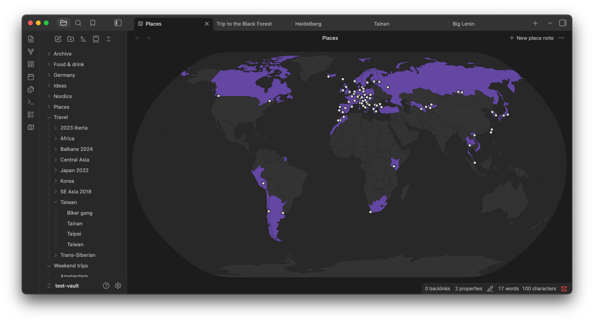

# Place Notes

Tie notes to places on a world map. Works entirely offline, on desktop
and mobile. Simple, unopiniated and markdown-native.



## How it works

A place note is an ordinary Markdown note with two optional properties:

```yaml
---
country: PT                      # ISO 3166-1 alpha-2
coordinates: [38.7169, -9.1399]  # latitude, longitude
---
```

The interactive map view lets you easily find and create these notes.

## Install

Install [Place Notes](https://community.obsidian.md/plugins/place-notes)
from Obsidian's community plugin directory, or in Obsidian go to
Settings -> Community plugins -> Browse and search for "Place Notes".

## Data and licenses

The plugin code is MIT licensed. It bundles:

- Country outlines from [Natural Earth](https://www.naturalearthdata.com/)
  (public domain).
- Country codes, city and town names from
  [GeoNames](https://www.geonames.org/), licensed under
  [CC BY 4.0](https://creativecommons.org/licenses/by/4.0/).
